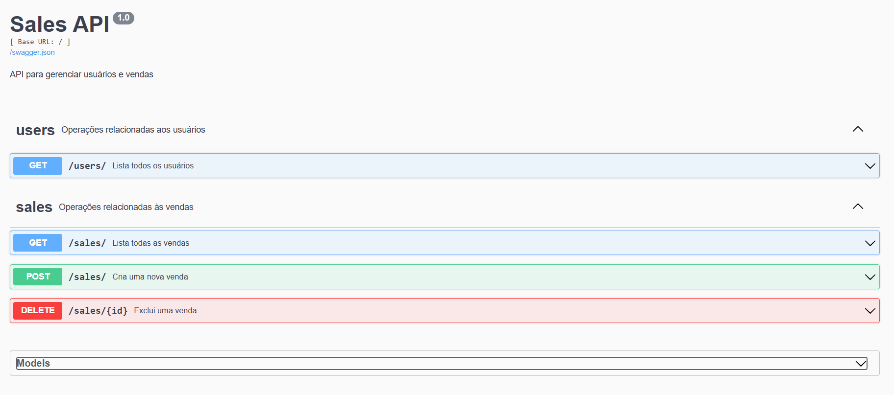

# Projeto MVC - Sales BACKEND

# Descrição:
Este projeto é uma API RESTful desenvolvida com Flask e SQLAlchemy, que visa gerenciar informações sobre usuários e vendas. Ele foi estruturado para ser simples e eficiente, permitindo a interação com um banco de dados SQLite para armazenar e consultar dados dos usuários e das vendas realizadas. O foco principal é fornecer endpoints que permitam realizar operações de CRUD (Create, Read, Update e Delete) para gerenciar essas entidades.

Passo a passo para executar via terminal:
1. `cd backend` - vai entrar na pasta do backend
2. `pip install -r requirements.txt` - instalando as dependências do projeto
3. `flask init_db` - vai criar e popular o sqlite com dados mockados
4. `flask run` - vai rodar a aplicação

### Rotas
Rotas
As rotas da API estão documentadas no Swagger. Após executar o comando flask run, acesse o seguinte endereço para visualizar a documentação das rotas:

Swagger UI: http://127.0.0.1:5000/

### Imagens:
