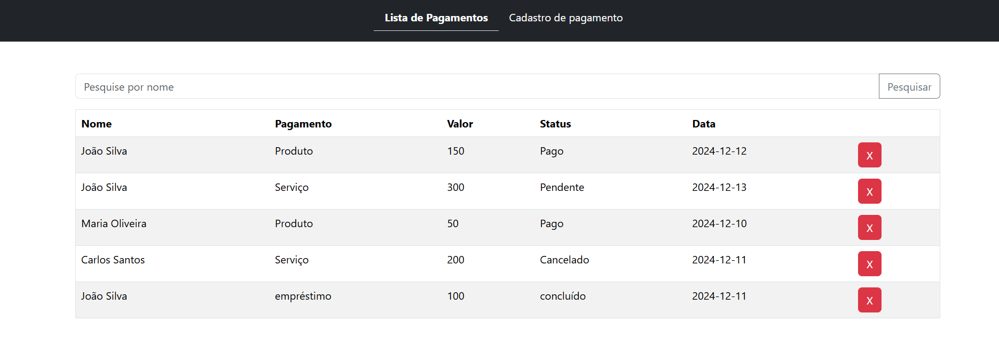
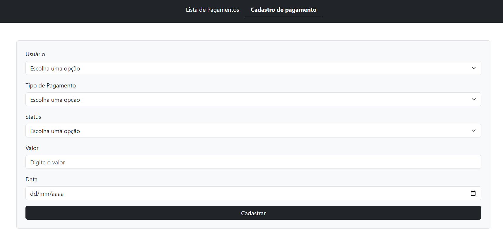

# Projeto MVC - Sales FRONTEND

### Descrição:
Este projeto frontend foi desenvolvido para consumir a API de vendas e usuários, criada com Flask, e exibir as informações de maneira simples e acessível. O foco é proporcionar uma interface limpa onde o usuário pode visualizar e interagir com os dados de usuários e vendas.

### Estrutura do projeto:
    /index.html          # Arquivo HTML principal
    main.js              # Código responsável pela comunicação com a API e funcionalidades da página index.html
    /src
        register.html    # Página para cadastrar uma venda
        register.js      # Código responsável pela comunicação com a API e funcionalidades da página registre.html

### Inicializando:
- Basta abrir o arquivo index.html no seu navegador.

- Caso tenha a extensão Live Server instalada no VSCode, você pode utilizá-la para rodar o projeto localmente

### Página index.html:
Esta página exibe uma tabela com os dados de vendas obtidos da API. Também é possível excluir uma venda e, usando apenas JavaScript, buscar uma venda específica.

### Página registre.html:
Esta página contém um formulário para cadastrar uma nova venda, enviando os dados para a API de backend.

### Imagens:

